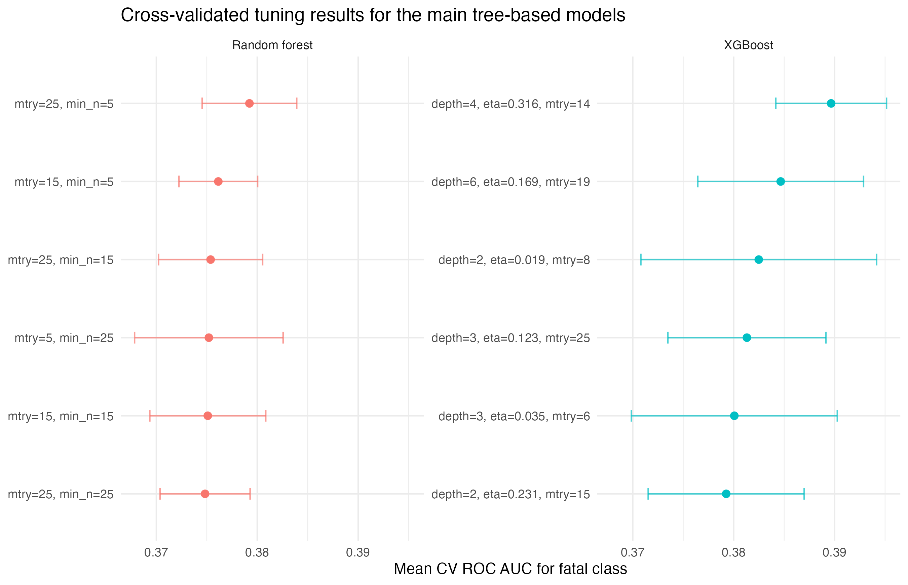
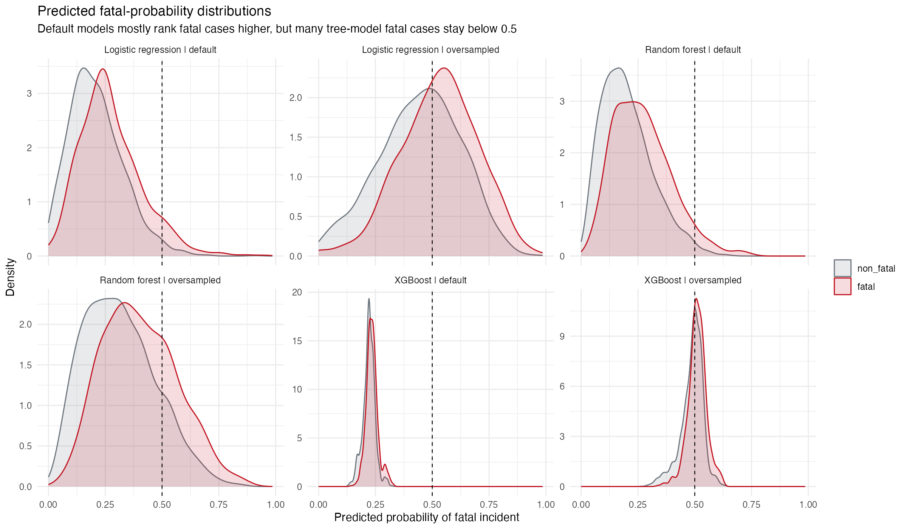
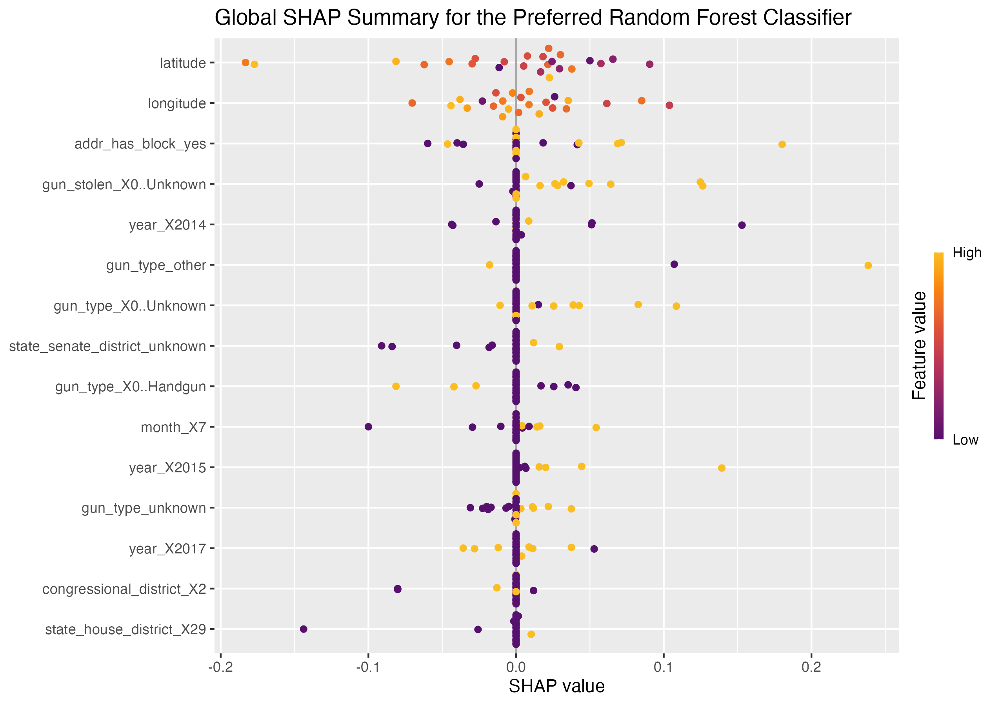

```{r}
#| label: setup
#| include: false
.libPaths(c("r-lib", .libPaths()))

library(tidyverse)
library(tidymodels)
library(themis)
library(janitor)
library(patchwork)
library(scales)
library(broom)
library(glue)

theme_set(theme_minimal(base_size = 11))
set.seed(30100)
```

```{r}
#| label: load-files
#| include: false
data_path <- "Data/stage3.csv"
default_results_path <- "results/three_model_default_results.csv"
imbalance_results_path <- "results/model_results_imbalance_strategies.csv"
threshold_results_path <- "results/threshold_results_balanced_accuracy.csv"

required_paths <- c(
  data_path,
  default_results_path,
  imbalance_results_path,
  threshold_results_path
)

missing_paths <- required_paths[!file.exists(required_paths)]

if (length(missing_paths) > 0) {
  stop("Expected project file(s) not found: ", paste(missing_paths, collapse = ", "))
}

stage3 <- readr::read_csv(data_path, show_col_types = FALSE) |>
  clean_names() |>
  mutate(
    date = as.Date(date),
    year = as.integer(format(date, "%Y")),
    month = as.integer(format(date, "%m")),
    fatal = factor(if_else(n_killed > 0, "fatal", "non_fatal"), levels = c("non_fatal", "fatal"))
  )

default_results <- readr::read_csv(default_results_path, show_col_types = FALSE)
imbalance_results <- readr::read_csv(imbalance_results_path, show_col_types = FALSE)
threshold_results <- readr::read_csv(threshold_results_path, show_col_types = FALSE)

analysis_df <- stage3 |>
  transmute(
    fatal,
    year = factor(year),
    month = factor(month),
    day_of_week = factor(weekdays(date)),
    weekend = factor(if_else(lubridate::wday(date, week_start = 1) >= 6, "weekend", "weekday")),
    state = factor(state),
    city_or_county = factor(city_or_county),
    gun_stolen = factor(gun_stolen),
    gun_type = factor(gun_type),
    n_guns_involved,
    latitude,
    longitude,
    congressional_district = factor(congressional_district),
    state_house_district = factor(state_house_district),
    state_senate_district = factor(state_senate_district),
    addr_has_block = factor(if_else(str_detect(replace_na(address, ""), regex("block", ignore_case = TRUE)), "yes", "no")),
    addr_has_intersection = factor(if_else(str_detect(replace_na(address, ""), regex(" and | & | at ", ignore_case = TRUE)), "yes", "no")),
    addr_has_road = factor(if_else(str_detect(replace_na(address, ""), regex("road|\\brd\\b|street|\\bst\\b|avenue|\\bave\\b|boulevard|\\bblvd\\b", ignore_case = TRUE)), "yes", "no")),
    has_teen = factor(if_else(str_detect(replace_na(participant_age_group, ""), stringr::fixed("Teen 12-17")), "yes", "no")),
    has_child = factor(if_else(str_detect(replace_na(participant_age_group, ""), stringr::fixed("Child 0-11")), "yes", "no"))
  )

target_model_n <- min(40000, nrow(analysis_df))
split_obj <- initial_split(analysis_df, prop = 0.80, strata = fatal)
train_data <- training(split_obj)
test_data <- testing(split_obj)

train_target_n <- floor(target_model_n * 0.80)
test_target_n <- target_model_n - train_target_n

if (nrow(train_data) > train_target_n) {
  train_data <- train_data |>
    group_by(fatal) |>
    slice_sample(prop = train_target_n / nrow(train_data)) |>
    ungroup()
}

if (nrow(test_data) > test_target_n) {
  test_data <- test_data |>
    group_by(fatal) |>
    slice_sample(prop = test_target_n / nrow(test_data)) |>
    ungroup()
}

folds <- vfold_cv(train_data, v = 3, strata = fatal)

basic_recipe <- recipe(fatal ~ ., data = train_data) |>
  step_indicate_na(n_guns_involved, latitude, longitude) |>
  step_impute_median(all_numeric_predictors()) |>
  step_unknown(all_nominal_predictors()) |>
  step_other(city_or_county, gun_stolen, gun_type, threshold = 0.01, other = "other") |>
  step_novel(all_nominal_predictors()) |>
  step_dummy(all_nominal_predictors()) |>
  step_zv(all_predictors())

normalized_recipe <- basic_recipe |>
  step_normalize(all_numeric_predictors())

rf_spec <- rand_forest(mtry = 25, min_n = 5, trees = 400) |>
  set_engine("ranger", probability = TRUE) |>
  set_mode("classification")

xgb_spec <- boost_tree(
  trees = 363,
  tree_depth = 2,
  learn_rate = 0.0187,
  mtry = 8,
  min_n = 13,
  loss_reduction = 2.31,
  sample_size = 0.727
) |>
  set_engine("xgboost", eval_metric = "auc") |>
  set_mode("classification")

logit_spec <- logistic_reg() |>
  set_engine("glm") |>
  set_mode("classification")

rf_fit_plot <- workflow() |>
  add_recipe(basic_recipe) |>
  add_model(rf_spec) |>
  fit(train_data)

xgb_fit_plot <- workflow() |>
  add_recipe(basic_recipe) |>
  add_model(xgb_spec) |>
  fit(train_data)

logit_fit_plot <- workflow() |>
  add_recipe(normalized_recipe) |>
  add_model(logit_spec) |>
  fit(train_data)

roc_plot_data <- bind_rows(
  test_data |>
    bind_cols(predict(rf_fit_plot, test_data, type = "prob")) |>
    transmute(fatal, .pred_fatal, model = "Random forest"),
  test_data |>
    bind_cols(predict(xgb_fit_plot, test_data, type = "prob")) |>
    transmute(fatal, .pred_fatal, model = "XGBoost"),
  test_data |>
    bind_cols(predict(logit_fit_plot, test_data, type = "prob")) |>
    transmute(fatal, .pred_fatal, model = "Logistic regression")
)

roc_curve_tbl <- roc_plot_data |>
  group_by(model) |>
  roc_curve(fatal, .pred_fatal, event_level = "second") |>
  ungroup() |>
  mutate(
    model = factor(model, levels = c("Random forest", "XGBoost", "Logistic regression"))
  )

roc_auc_labels <- roc_plot_data |>
  group_by(model) |>
  roc_auc(fatal, .pred_fatal, event_level = "second") |>
  ungroup() |>
  mutate(
    model = factor(model, levels = c("Random forest", "XGBoost", "Logistic regression")),
    panel_label = glue("{model}\nAUC = {number(.estimate, accuracy = 0.001)}")
  ) |>
  select(model, panel_label)

rf_default <- imbalance_results |>
  filter(setup == "Random forest | default") |>
  slice(1)

rf_weighted <- imbalance_results |>
  filter(setup == "Random forest | class weight") |>
  slice(1)

rf_oversampled <- imbalance_results |>
  filter(setup == "Random forest | oversampled") |>
  slice(1)

rf_threshold <- imbalance_results |>
  filter(setup == "Random forest | threshold moved") |>
  slice(1)

xgb_oversampled <- imbalance_results |>
  filter(setup == "XGBoost | oversampled") |>
  slice(1)

threshold_constrained_tbl <- tibble(
  model = c("Random forest", "XGBoost", "Logistic regression"),
  threshold = c(0.27, 0.25, 0.28),
  bal_accuracy = c(0.602, 0.551, 0.579),
  sensitivity = c(0.462, 0.238, 0.400),
  specificity = c(0.743, 0.864, 0.757)
)
```

## 1. Introduction
This report studies a practical prediction problem: using structured incident-level information, can we distinguish gun violence incidents that become fatal from those that do not? The outcome is binary, fatal versus non-fatal, and the predictors are limited to structured variables that are plausibly available from the incident record itself, including time, broad location, district identifiers, basic gun information, and simple derived indicators from the address and age-group fields. The practical value is not perfect classification, but whether structured incident records can support earlier screening of higher-risk cases. The goal is predictive rather than causal. I am not estimating the effect of any one factor. I am asking whether a cleaned, defensible feature set contains useful signal for classification. More substantively, the project also asks whether the limited structured information available in incident records is enough to support meaningful severity screening, and whether the usable signal comes mainly from immediate incident descriptors or from broader contextual and place-related markers.

Recent work on firearm violence and related public-safety outcomes suggests two relevant points. First, even noisy administrative or surveillance-style data can contain predictive information about victimization or severe injury outcomes [@goin2018; @heller2022; @polcari2023; @zhou2024jamia]. Second, prediction is still difficult because these data are incomplete, unevenly reported, and often dominated by non-event or lower-severity cases [@swedo2023]. Prior work also emphasizes that the practical goal is often screening or community risk identification rather than perfect classification [@polcari2023]. Those concerns matter directly here. Structured contextual variables may still carry signal, but missingness can distort what is usable, and class imbalance can make a model look stronger than it really is if evaluation relies too heavily on raw accuracy.

This project gives a clean comparison. I keep the revised leakage-safe pipeline, use logistic regression as the formal baseline model, compare it against two selected nonlinear models on the same final feature set, and then examine how class weighting, oversampling, and threshold moving change the practical detection of fatal incidents. That second step matters because the model with the best overall ranking is not automatically the best decision rule for the minority class.

Repository / shared materials link: [macss30100_Gun_violence](https://github.com/JiahaoZhang2001/macss30100_Gun_violence)

## 2. Data and Outcome Definition
The original records come from Gun Violence Archive incident listings that had already been assembled for the course project into a local structured file. The analysis in this report begins from [`stage3.csv`](/Users/jiahaozhang/Desktop/macs%2030100/project/Final%20Episode/Data/stage3.csv), which is the project’s cleaned stage-three working dataset rather than a live scrape. It contains incident-level observations, original URLs, and a larger set of structured fields created earlier in the project workflow. The underlying source records were collected earlier in the course project workflow, and the present report does not re-scrape the live source. Instead, it starts from the saved cleaned file `stage3.csv`, which was generated from those earlier source records and retained as the local analysis dataset for the final report. In other words, `stage3.csv` is the final local analysis file derived from the original incident-source records, and every table and figure below is produced from that file or from saved result tables generated from it.

The binary outcome is defined as

```{r}
#| label: outcome-definition
#| echo: true
stage3 <- stage3 |>
  mutate(
    fatal = factor(
      if_else(n_killed > 0, "fatal", "non_fatal"),
      levels = c("non_fatal", "fatal")
    )
  )
```

\[
\texttt{fatal} = 1(\texttt{n\_killed} > 0)
\]

This definition is simple, auditable, and aligned with the question of whether an incident crossed the line from non-fatal to fatal harm. I use this binary target instead of directly modeling `n_killed` because the death count is highly right-skewed with many zeros, so a count outcome would mix a much harder distributional problem into what is mainly a screening task. It also has limits. It does not distinguish one death from multiple deaths, and it treats all non-fatal incidents as one group even when injury severity varies a lot. So the target is useful for a first predictive exercise, but it is still a coarse measure of harm.

```{r}
#| label: data-overview
overview_tbl <- tibble(
  metric = c(
    "Rows in stage3.csv",
    "Columns in stage3.csv",
    "Date range",
    "Fatal incidents",
    "Non-fatal incidents",
    "Fatal share"
  ),
  value = c(
    comma(nrow(stage3)),
    ncol(stage3),
    paste(min(stage3$date, na.rm = TRUE), "to", max(stage3$date, na.rm = TRUE)),
    comma(sum(stage3$fatal == "fatal")),
    comma(sum(stage3$fatal == "non_fatal")),
    percent(mean(stage3$fatal == "fatal"), accuracy = 0.1)
  )
)

knitr::kable(overview_tbl, caption = "Working dataset and outcome overview")
```

The fatal class accounts for about `r percent(mean(stage3$fatal == "fatal"), accuracy = 0.1)` of the full file. That imbalance is important from the start because a model can achieve respectable accuracy while still missing most fatal incidents. For that reason, later sections emphasize balanced accuracy and fatal recall rather than accuracy alone.

## 3. Exploratory Data Analysis
The EDA is used here to support modeling choices rather than to survey every field in the file. I focus on dataset coverage, predictor structure, and a few patterns that motivate the final retained feature set.

### 3.1 Dataset Overview
```{r}
#| label: missingness
missingness <- stage3 |>
  summarise(across(everything(), ~ sum(is.na(.x)))) |>
  pivot_longer(everything(), names_to = "feature", values_to = "missing_n") |>
  mutate(missing_pct = missing_n / nrow(stage3)) |>
  arrange(desc(missing_n))

knitr::kable(
  head(missingness, 15) |>
    mutate(missing_pct = percent(missing_pct, accuracy = 0.1)),
  caption = "Top 15 fields by missingness"
)
```

Several detailed relationship, participant, and narrative-style variables have substantial missingness. That matters because sparse fields can create an illusion of richness without producing stable predictive signal. It also supports a conservative modeling decision: use the cleaner structured variables and avoid heavily reported-after-the-fact fields in the final predictive set.

```{r}
#| label: casualty-distributions
#| fig-width: 8
#| fig-height: 3.8
injury_cap <- quantile(stage3$n_injured, probs = 0.99, na.rm = TRUE)
killed_cap <- quantile(stage3$n_killed, probs = 0.99, na.rm = TRUE)

p_injured <- stage3 |>
  filter(!is.na(n_injured), n_injured <= injury_cap) |>
  ggplot(aes(x = n_injured)) +
  geom_histogram(binwidth = 1, fill = "#2C7FB8", alpha = 0.85) +
  labs(
    title = "Distribution of Injuries",
    subtitle = "Trimmed at the 99th percentile for display only",
    x = "n_injured",
    y = "Incident count"
  )

p_killed <- stage3 |>
  filter(!is.na(n_killed), n_killed <= killed_cap) |>
  ggplot(aes(x = n_killed)) +
  geom_histogram(binwidth = 1, fill = "#D95F0E", alpha = 0.85) +
  labs(
    title = "Distribution of Deaths",
    subtitle = "Trimmed at the 99th percentile for display only",
    x = "n_killed",
    y = "Incident count"
  )

p_injured + p_killed
```

The casualty distributions are strongly right-skewed. Most incidents have low counts, while a smaller number of extreme events create a long tail. This shows that the data are dominated by lower-casualty incidents, so a simple average would hide the basic shape of the outcome. It also helps explain why the report focuses on a binary fatal indicator instead of directly modeling the count of deaths. A count model would have to deal with both heavy skew and a large concentration of small values, while the present project is more directly interested in whether an incident becomes fatal at all.

### 3.2 Predictor Overview
```{r}
#| label: predictor-preview
#| fig-width: 5.0
#| fig-height: 4.1
numeric_features <- stage3 |>
  select(latitude, longitude, n_guns_involved, year, month)

cor_mat <- cor(numeric_features, use = "pairwise.complete.obs")

cor_long <- as_tibble(as.data.frame(as.table(cor_mat))) |>
  rename(feature_x = Var1, feature_y = Var2, correlation = Freq)

cor_long |>
  ggplot(aes(x = feature_x, y = feature_y, fill = correlation)) +
  geom_tile(color = "white") +
  scale_fill_gradient2(low = "#2166AC", mid = "white", high = "#B2182B", midpoint = 0) +
  labs(title = "Correlation Heatmap of Numeric Predictors", x = NULL, y = NULL, fill = "r") +
  theme(
    plot.title = element_text(size = 12),
    axis.text.x = element_text(angle = 35, hjust = 1, size = 8),
    axis.text.y = element_text(size = 8),
    legend.title = element_text(size = 9),
    legend.text = element_text(size = 8)
  )
```

The numeric predictors that remain in the final operational feature set are not strongly collinear. This is helpful because the model is not depending on a single duplicated numeric signal, and it reduces the risk that the final classifier appears more stable than it really is because several variables are carrying nearly the same information. At the same time, the district identifiers are not treated as numeric quantities in modeling. They are identifiers, so they are handled as categorical variables later in the pipeline rather than being interpreted as ordered magnitudes.

To complement the heatmap, I also cluster the retained numeric predictors using a distance of `1 - |correlation|`. This is only a descriptive check, but it gives a compact view of whether the remaining numeric variables form obvious groups before modeling.

```{r}
#| label: feature-clustering
#| fig-width: 5.4
#| fig-height: 4.2
feature_dist <- as.dist(1 - abs(cor_mat))
hc_features <- hclust(feature_dist, method = "complete")
plot(
  hc_features,
  main = "Hierarchical Clustering of Retained Numeric Predictors",
  xlab = "",
  sub = "",
  cex = 0.85
)
```

The clustering result is consistent with the heatmap: there is no tight block of highly redundant numeric features in the retained set. Latitude and longitude naturally sit closer to each other than to the time or gun-count variables, but the overall structure remains fairly weak. In practical terms, this means the retained numeric predictors seem to contribute different kinds of information rather than collapsing into one dominant dimension. That pattern supports keeping these predictors together in the final pipeline and treating each as a separate possible source of signal.

### 3.3 Initial Patterns
```{r}
#| label: time-and-state-patterns
#| fig-width: 8.5
#| fig-height: 6.4
yearly <- stage3 |>
  filter(!is.na(year)) |>
  group_by(year) |>
  summarise(
    incidents = n(),
    fatal_share = mean(fatal == "fatal"),
    .groups = "drop"
  )

top_states <- stage3 |>
  count(state, sort = TRUE) |>
  slice_head(n = 12) |>
  mutate(state = forcats::fct_reorder(state, n))

p_year_count <- yearly |>
  ggplot(aes(x = year, y = incidents)) +
  geom_line(linewidth = 0.8, color = "#1F78B4") +
  geom_point(size = 1.2, color = "#1F78B4") +
  scale_y_continuous(labels = comma) +
  labs(title = "Annual Incident Volume", x = "Year", y = "Incidents")

p_year_fatal <- yearly |>
  ggplot(aes(x = year, y = fatal_share)) +
  geom_line(linewidth = 0.8, color = "#B15928") +
  geom_point(size = 1.2, color = "#B15928") +
  scale_y_continuous(labels = percent_format(accuracy = 1)) +
  labs(title = "Annual Fatal Share", x = "Year", y = "Fatal share")

p_state <- top_states |>
  ggplot(aes(x = state, y = n)) +
  geom_col(fill = "#33A02C") +
  coord_flip() +
  scale_y_continuous(labels = comma) +
  labs(title = "Top 12 States by Incident Count", x = NULL, y = "Incidents")

(p_year_count / p_year_fatal) | p_state
```

Incident volume and fatal share do not move in the same way across years or across states. Some places contribute many incidents without having the highest fatal share, while the year-to-year pattern in incidence does not mechanically track the year-to-year pattern in fatality. This supports keeping time and location variables in the predictive set, because they appear to carry nontrivial contextual information. At the same time, it suggests that those fields should be interpreted as markers of place and timing rather than as direct explanations of why an individual incident becomes fatal.

```{r}
#| label: spatial-density
#| fig-width: 8.2
#| fig-height: 4.5
stage3 |>
  filter(!is.na(longitude), !is.na(latitude)) |>
  ggplot(aes(x = longitude, y = latitude)) +
  stat_density_2d_filled(
    aes(fill = after_stat(level)),
    contour_var = "ndensity",
    alpha = 0.9
  ) +
  facet_wrap(~ fatal, ncol = 2) +
  coord_quickmap() +
  scale_fill_viridis_d(name = "Density", option = "C") +
  labs(
    title = "Spatial density of incidents by fatal outcome",
    subtitle = "Separate density surfaces for fatal and non-fatal incidents",
    x = "Longitude",
    y = "Latitude"
  ) +
  theme(legend.position = "right")
```

This figure gives a more direct spatial view of the same point. Incidents are not spread evenly across the map, and the highest-density areas for fatal and non-fatal incidents overlap only partly rather than perfectly. That does not mean location alone determines fatality, but it does suggest that geographic context carries predictive information beyond simple incident counts. These spatial differences may reflect contextual and reporting differences, not causal effects of place itself. It also helps explain why location variables later appear as important contributors in the tree-based models. Overall, the figure supports keeping latitude, longitude, and broader administrative location fields in the final feature set while still treating them as contextual predictors rather than causal claims.

For presentation in the PDF report, I keep this static density figure because it is easier to read on the page. I also created an interactive leaflet map that extends this same spatial view and makes it easier to inspect local clustering more directly. The interactive version can be accessed through the GitHub repository link listed in the Introduction, under the project materials and README, where it is linked as an interactive map webpage. The static density figure above remains the clearer choice for the main written report.

```{r}
#| label: top-characteristics
#| fig-width: 6.8
#| fig-height: 4.5
top_characteristics <- stage3 |>
  transmute(incident_characteristics) |>
  filter(!is.na(incident_characteristics), incident_characteristics != "") |>
  mutate(incident_characteristics = str_squish(incident_characteristics)) |>
  separate_rows(incident_characteristics, sep = "\\|\\||\\||\\^") |>
  mutate(incident_characteristics = str_squish(incident_characteristics)) |>
  filter(incident_characteristics != "") |>
  count(incident_characteristics, sort = TRUE) |>
  slice_head(n = 15) |>
  mutate(incident_characteristics = forcats::fct_reorder(incident_characteristics, n))

top_characteristics |>
  ggplot(aes(x = incident_characteristics, y = n)) +
  geom_col(fill = "#6A3D9A") +
  coord_flip() +
  scale_y_continuous(labels = comma) +
  labs(title = "Most Common Incident Characteristic Tags", x = NULL, y = "Count")
```

I keep `incident_characteristics` in the EDA because it is descriptive and helps show what kinds of incidents appear in the file. It gives a clearer sense of the substantive mix of events represented in the dataset and helps explain why the source file is tempting to over-engineer. At the same time, I do not use it in the final model because it is a documentation-heavy field. Using this field would likely improve apparent predictive power, but at the cost of mixing incident information with after-the-fact coding intensity. More detailed tagging may reflect how fully an incident was later described or coded, including local reporting habits, rather than the incident itself. In other words, it is useful for understanding the dataset, but too risky to treat as a clean predictor.

## 4. Feature Construction and Final Modeling Set
The final modeling set is intentionally narrower than the full file. I keep only structured fields that are reasonably interpretable as incident-time or near-incident information and that can be represented cleanly in a predictive pipeline. In practice, the retained predictors fall into five groups: time markers (`year`, `month`, `day_of_week`, `weekend`), broad location fields (`state`, `city_or_county`, latitude, longitude), administrative district identifiers (`congressional_district`, `state_house_district`, `state_senate_district`), basic gun-related variables (`gun_stolen`, `gun_type`, `n_guns_involved`), and simple engineered indicators from existing structured text (`addr_has_block`, `addr_has_intersection`, `addr_has_road`, `has_teen`, `has_child`).

I keep these variables for straightforward reasons. Time and broad location may capture recurring seasonal or geographic context. The district fields may absorb coarse administrative or neighborhood patterning, but I treat them only as identifiers, not as ordered numeric quantities. The gun variables are among the few structured incident descriptors available in the file. The address flags and age-group indicators are simple summaries that can be built from the existing record without introducing long narrative text into the model.

I exclude variables that are either too close to the outcome or too vulnerable to leakage and documentation effects. In particular, I do not use `n_injured`, because it is too tightly connected to incident severity and would blur the distinction between predictors and consequences. I also do not restore `notes`, `location_description`, or `incident_characteristics`, because richer descriptions may reflect reporting intensity, local documentation habits, or after-the-fact write-up rather than characteristics of the incident itself. This same logic is why I do not add back summary features derived from those narrative-style fields. The goal here is not to maximize predictive power at any cost, but to keep a defensible final feature set.

Missing data are handled conservatively rather than by dropping incomplete rows. The main missingness problem in the final retained set is in a few numeric and location-related fields, especially `n_guns_involved`, `latitude`, and `longitude`, while many categorical fields also contain explicit unknown-style values or sparse rare levels. I keep the rows and handle those issues inside the training-only preprocessing pipeline. Numeric predictors receive median imputation plus missingness indicators, so the model can use both the imputed value and the fact that the value was originally missing. Categorical predictors receive an explicit unknown level, and very rare levels in high-cardinality fields are pooled into `"other"` before dummy encoding. That approach keeps the sample size stable and avoids leaking information from the full dataset into the training step.

```{r}
#| label: feature-construction-snippet
#| echo: true
feature_snippet <- stage3 |>
  transmute(
    fatal,
    year = factor(year),
    month = factor(month),
    state = factor(state),
    city_or_county = factor(city_or_county),
    gun_stolen = factor(gun_stolen),
    gun_type = factor(gun_type),
    n_guns_involved,
    latitude,
    longitude,
    congressional_district = factor(congressional_district),
    addr_has_block = factor(if_else(str_detect(replace_na(address, ""), regex("block", ignore_case = TRUE)), "yes", "no")),
    has_teen = factor(if_else(str_detect(replace_na(participant_age_group, ""), stringr::fixed("Teen 12-17")), "yes", "no"))
  )
```

This short excerpt is only a representative view of the full feature construction. It shows the main pattern: structured timing and location fields are retained directly, while a small number of simple indicators are derived from existing text fields without bringing narrative content into the final model.

```{r}
#| label: feature-inventory
feature_inventory <- tibble(
  feature = names(analysis_df)[-1],
  type = c(
    "categorical", "categorical", "categorical", "categorical", "categorical", "categorical",
    "categorical", "categorical", "numeric", "numeric", "numeric", "categorical", "categorical", "categorical",
    "categorical", "categorical", "categorical", "categorical", "categorical"
  ),
  missing_pct = purrr::map_dbl(analysis_df[-1], ~ mean(is.na(.x))),
  distinct_values = purrr::map_int(analysis_df[-1], ~ dplyr::n_distinct(.x, na.rm = TRUE))
)

knitr::kable(
  feature_inventory |>
    mutate(missing_pct = percent(missing_pct, accuracy = 0.1)),
  caption = "Final retained modeling features"
)
```

To make the retained features more concrete, the next two tables summarize the numeric and categorical predictors separately. The most important point is that the retained raw feature set is relatively compact and interpretable before dummy expansion: three numeric variables, several time and location identifiers, three district identifiers treated as factors, three simple address flags, and two participant age-group indicators.

```{r}
#| label: feature-descriptive-stats
numeric_feature_stats <- analysis_df |>
  select(n_guns_involved, latitude, longitude) |>
  pivot_longer(everything(), names_to = "feature", values_to = "value") |>
  group_by(feature) |>
  summarise(
    missing_pct = percent(mean(is.na(value)), accuracy = 0.1),
    mean = number(mean(value, na.rm = TRUE), accuracy = 0.01),
    sd = number(sd(value, na.rm = TRUE), accuracy = 0.01),
    median = number(median(value, na.rm = TRUE), accuracy = 0.01),
    p90 = number(quantile(value, probs = 0.90, na.rm = TRUE), accuracy = 0.01),
    .groups = "drop"
  )

categorical_feature_stats <- analysis_df |>
  select(-fatal, -n_guns_involved, -latitude, -longitude) |>
  pivot_longer(everything(), names_to = "feature", values_to = "value") |>
  group_by(feature) |>
  summarise(
    missing_pct = percent(mean(is.na(value)), accuracy = 0.1),
    distinct_values = n_distinct(value, na.rm = TRUE),
    mode = names(sort(table(value), decreasing = TRUE))[1],
    mode_share = percent(max(prop.table(table(value))), accuracy = 0.1),
    .groups = "drop"
  )

knitr::kable(numeric_feature_stats, caption = "Descriptive statistics for retained numeric features")
knitr::kable(categorical_feature_stats, caption = "Summary of retained categorical features")
```

Taken together, these tables answer two practical questions. First, what are the features? They are the structured time, location, gun, district, address, and age-group variables listed above and in Table 4. Second, what do they look like in the data? The numeric summary shows scale and missingness for the continuous predictors, while the categorical summary shows how much variation each factor contains and whether it is dominated by one common level. I still retain `city_or_county` because the EDA and later tree-based interpretation both suggest that broad geographic context carries predictive signal, even if that signal must be interpreted cautiously.

For the comparative modeling stage, I target a stratified 40,000-observation analysis sample drawn after the initial train/test split. This enlarged sample strengthens the main comparison among random forest, XGBoost, and logistic regression without changing the cleaned feature logic. The RBF SVM branch remains a secondary benchmark only. Because kernel runtime scales poorly at this size, I do not use SVM in the enlarged-sample main results or in the final substantive recommendation. The only smaller sample used in the report itself is the SHAP interpretation subset, which is used only for computational convenience after the preferred model has already been fit.

## 5. Modeling Strategy
### 5.1 Clean Pipeline
The key modeling principle is that the split comes before all learned preprocessing. Missing-value handling, rare-level consolidation, dummy encoding, and normalization are estimated on the training data only and then applied to validation or test data. That is the main correction that prevents the leakage problem from the earlier draft.

```{r}
#| label: split-data
#| echo: true
split_obj <- initial_split(analysis_df, prop = 0.80, strata = fatal)
train_data <- training(split_obj)
test_data <- testing(split_obj)

model_n <- min(40000, nrow(analysis_df))
train_n <- floor(model_n * 0.80)
test_n <- model_n - train_n

if (nrow(train_data) > train_n) {
  train_data <- train_data |>
    group_by(fatal) |>
    slice_sample(prop = train_n / nrow(train_data)) |>
    ungroup()
}

if (nrow(test_data) > test_n) {
  test_data <- test_data |>
    group_by(fatal) |>
    slice_sample(prop = test_n / nrow(test_data)) |>
    ungroup()
}

basic_recipe <- recipe(fatal ~ ., data = train_data) |>
  step_indicate_na(n_guns_involved, latitude, longitude) |>
  step_impute_median(all_numeric_predictors()) |>
  step_unknown(all_nominal_predictors()) |>
  step_other(city_or_county, gun_stolen, gun_type, threshold = 0.01, other = "other") |>
  step_novel(all_nominal_predictors()) |>
  step_dummy(all_nominal_predictors()) |>
  step_zv(all_predictors())
```

```{r}
#| label: split-diagnostics
split_tbl <- tibble(
  split = c("train", "test"),
  n = c(nrow(train_data), nrow(test_data)),
  fatal_share = c(mean(train_data$fatal == "fatal"), mean(test_data$fatal == "fatal"))
) |>
  mutate(fatal_share = percent(fatal_share, accuracy = 0.1))

knitr::kable(split_tbl, caption = "Train/test split diagnostics for the 40,000-observation modeling sample")
```

This preprocessing corresponds directly to the feature decisions in Section 4. `step_indicate_na()` preserves information about whether key numeric variables were originally missing. `step_impute_median()` fills those numeric gaps without borrowing from the test set. `step_unknown()` and `step_novel()` make categorical handling more stable when some levels are absent in one split but appear in another. `step_other()` is especially important for `city_or_county`, `gun_stolen`, and `gun_type`, because those fields contain many sparse categories that would otherwise create a very wide and unstable design matrix. Finally, `step_dummy()` converts the retained categorical features into model-ready indicators. For scale-sensitive models, I then extend this shared `basic_recipe` into a separate `normalized_recipe` by adding `step_normalize(all_numeric_predictors())`; that extra step is used for logistic regression in the comparison workflows, while the tree-based models keep the unnormalized version.

### 5.2 Models Compared
The baseline comparison keeps three primary classifiers: logistic regression, random forest, and XGBoost. Logistic regression is the formal baseline because it is the simplest and most transparent benchmark. Random forest and XGBoost are the two selected additional models because they can capture nonlinear structure and interactions in structured tabular data. I keep SVM only as a secondary benchmark outside the enlarged-sample main comparison because its kernel runtime scales poorly and it does not affect the final substantive recommendation.

For the main model-selection stage, I tuned the tree-based models inside the training data only. Random forest was tuned over `mtry` and `min_n` with `trees = 400` fixed. XGBoost was tuned over `trees`, `tree_depth`, `learn_rate`, `mtry`, `min_n`, `loss_reduction`, and `sample_size`. In both cases, I used cross-validation and selected the final specification by ROC AUC for the fatal class, entirely within the training and resampling framework rather than on the held-out test set. The baseline comparison therefore reflects the formal logistic baseline alongside tuned nonlinear comparison models. After those hyperparameters were fixed, I kept the resulting model specifications stable in the later imbalance analysis so that the report would focus on decision rules and classification trade-offs rather than repeated retuning.

The next figure is a tuning summary rather than a final-results figure. Each point represents one candidate hyperparameter setting, and the horizontal position shows its mean cross-validated ROC AUC for the fatal class. The purpose of this step is to show that the tree-based models were tuned inside the training data before the final held-out comparison.

```{r}
#| label: tuning-figure
#| out-width: "88%"
#| fig-align: center

```

The tuning results show that the better random-forest settings were concentrated in a relatively small part of the search grid, while XGBoost was more sensitive to the joint choice of depth, learning rate, and feature subsampling. I do not treat the exact winning values as substantively meaningful, because small differences across candidate settings can easily reflect finite-sample variation rather than a deep substantive truth about the problem. The point of the tuning step is simply to avoid comparing a reasonably tuned tree model against a poorly specified one. It also helps show that the later baseline comparison is not driven by arbitrary defaults alone. After the tuning stage, I carry the selected random-forest specification into the main comparison with the workflow below.

```{r}
#| label: representative-model
#| echo: true
rf_fit <- workflow() |>
  add_recipe(basic_recipe) |>
  add_model(rf_spec) |>
  fit(train_data)
```

### 5.3 Evaluation Metrics
I report ROC AUC, accuracy, balanced accuracy, fatal sensitivity, and non-fatal specificity. ROC AUC describes how well a model ranks fatal incidents above non-fatal incidents across all possible thresholds. Accuracy is the overall share of correct classifications, but in this dataset it can be misleading because non-fatal incidents are much more common. Sensitivity for the fatal class means the share of truly fatal incidents that the model correctly flags as fatal. Specificity for the non-fatal class means the share of truly non-fatal incidents that the model correctly leaves in the non-fatal category. Balanced accuracy is the average of those two rates, so it is useful here because it does not let the majority class dominate the summary.

In this setting, a model with low sensitivity misses many fatal incidents, while a model with low specificity falsely flags many non-fatal incidents as fatal. That is why the later imbalance analysis emphasizes the trade-off between these two quantities rather than reading accuracy alone.

The metric rule in the rest of the report is simple. I select the underlying classifier by ROC AUC because it evaluates ranking performance without fixing a cutoff. I then select the final operating threshold by balanced accuracy, while using fatal recall and non-fatal specificity to interpret the practical trade-off. For this application, I still place somewhat more weight on recall for the fatal class than on precision or raw accuracy alone, because missing a truly fatal incident is more costly than flagging some non-fatal incidents as higher risk. At the same time, I do not want false positives to grow without bound. That is why recall informs the interpretation, but does not replace ROC AUC as the rule for choosing the underlying classifier. For the final operating rule, I compare balanced-accuracy-based threshold moving with a more conservative specificity-constrained threshold check.

## 6. Baseline Model Comparison
The baseline comparison uses the saved held-out results from [`three_model_default_results.csv`](/Users/jiahaozhang/Desktop/macs%2030100/project/Final%20Episode/results/three_model_default_results.csv), which apply the same cleaned feature set and default threshold of 0.50 on the 40,000-observation modeling sample.

```{r}
#| label: baseline-comparison
baseline_tbl <- default_results |>
  mutate(
    roc_auc = round(roc_auc, 4),
    accuracy = round(accuracy, 4),
    bal_accuracy = round(bal_accuracy, 4),
    sensitivity_fatal = round(sensitivity_fatal, 4),
    specificity_nonfatal = round(specificity_nonfatal, 4)
  ) |>
  arrange(desc(roc_auc), desc(bal_accuracy))

knitr::kable(
  baseline_tbl,
  caption = "Default three-model comparison on the held-out test set"
)
```

```{r}
#| label: model-roc-comparison
#| echo: true
#| fig-width: 7.8
#| fig-height: 4.8
roc_curve_tbl |>
  left_join(roc_auc_labels, by = "model") |>
  ggplot(aes(x = 1 - specificity, y = sensitivity)) +
  geom_abline(linetype = 2, color = "gray45", linewidth = 0.4) +
  geom_path(color = "#1B4F72", linewidth = 0.9) +
  facet_wrap(~ panel_label, ncol = 3) +
  coord_equal() +
  labs(
    title = "Held-out ROC curves for the baseline and two selected comparison models",
    x = "False positive rate (1 - specificity)",
    y = "True positive rate (sensitivity)"
  )
```

The ROC panels make the three model-ranking patterns easier to compare without forcing nearly overlapping curves into a single plot. The main takeaway is not that one model dominates every part of the curve, but that random forest keeps a somewhat stronger ranking profile across the threshold range than the other two primary models. Logistic regression serves as the formal baseline, but in the enlarged-sample comparison random forest is the strongest overall performer because it has the highest ROC AUC (`r number(rf_default$roc_auc, accuracy = 0.0001)`) and the highest default balanced accuracy among the three primary models. This does not mean it already solves the practical classification problem under imbalance. Rather, it means it provides the strongest underlying score ranking before later decision-rule adjustments. I therefore carry the random forest forward as the preferred underlying classifier for the later imbalance adjustments. Despite moderate ROC AUC differences, all three default-threshold classifiers perform poorly at fatal-case detection.

## 7. Further Analysis: Class Imbalance and Decision Rules
The baseline results show why class imbalance matters. Several models have similar accuracy because they favor the majority class. To study this more directly, I compare three follow-up strategies: class weighting, oversampling, and threshold moving. In each case, the held-out test set remains untouched. The goal of this section is not to maximize fatal recall at any cost, but to examine which adjustment gives the most reasonable compromise once fatal-case detection is treated as somewhat more important than avoiding every false alarm.

```{r}
#| label: imbalance-overview
imbalance_tbl <- imbalance_results |>
  select(setup, threshold, roc_auc, accuracy, bal_accuracy, sensitivity_fatal, specificity_nonfatal) |>
  mutate(across(where(is.numeric), ~ round(.x, 4)))

knitr::kable(
  imbalance_tbl,
  caption = "Held-out comparison across imbalance-handling strategies"
)
```

### 7.1 Class Weighting
Class weighting keeps the original training rows but tells the algorithm to penalize mistakes on fatal incidents more heavily than mistakes on non-fatal incidents. The idea is to make the minority class more influential without duplicating observations.

```{r}
#| label: class-weight-code
#| echo: true
#| eval: false
class_ratio <- sum(train_data$fatal == "non_fatal") / sum(train_data$fatal == "fatal")

rf_weighted_fit <- workflow() |>
  add_recipe(basic_recipe) |>
  add_model(
    rand_forest(mtry = 25, min_n = 5, trees = 400) |>
      set_engine(
        "ranger",
        probability = TRUE,
        class.weights = c(non_fatal = 1, fatal = class_ratio)
      ) |>
      set_mode("classification")
  ) |>
  fit(train_data)
```

In this project, weighting changes little. For random forest, balanced accuracy moves only from `r number(rf_default$bal_accuracy, accuracy = 0.0001)` under the default setup to `r number(rf_weighted$bal_accuracy, accuracy = 0.0001)` after weighting. That is too small to change the practical conclusion. The same general pattern holds for XGBoost: weighting by itself does not solve minority-class detection.

The interpretation is that weighting does not move the fitted decision boundary very much in this dataset. The models still behave mostly like majority-class classifiers at the default cutoff, so the gain in fatal detection is minimal. For that reason, class weighting is the weakest of the three imbalance strategies examined here. It is methodologically clean and easy to justify, but in this project it does not produce enough practical improvement to be the preferred adjustment.

### 7.2 Oversampling
Oversampling changes the training distribution itself. Instead of reweighting errors, it resamples the minority class so that the fitted model sees a more balanced mix of fatal and non-fatal cases during training. In the final workflow I implement this with `themis::step_upsample()` inside the recipe, using `over_ratio = 1` so that the minority `fatal` class is expanded to a 1:1 ratio with the majority class in the training data. I place the step near the front of the recipe so that later preprocessing steps are learned from the balanced training sample, and I keep the held-out test set untouched.

```{r}
#| label: oversampling-code
#| echo: true
#| eval: false
rf_oversampled_recipe <- recipe(fatal ~ ., data = train_data) |>
  step_upsample(fatal, over_ratio = 1, seed = 30100) |>
  step_indicate_na(n_guns_involved, latitude, longitude) |>
  step_impute_median(all_numeric_predictors()) |>
  step_unknown(all_nominal_predictors()) |>
  step_other(city_or_county, gun_stolen, gun_type, threshold = 0.01, other = "other") |>
  step_novel(all_nominal_predictors()) |>
  step_dummy(all_nominal_predictors()) |>
  step_zv(all_predictors())

rf_oversampled_fit <- workflow() |>
  add_recipe(rf_oversampled_recipe) |>
  add_model(rf_spec) |>
  fit(train_data)
```

This strategy has a clearer effect than class weighting. For random forest, fatal recall rises from `r number(rf_default$sensitivity_fatal, accuracy = 0.0001)` to `r number(rf_oversampled$sensitivity_fatal, accuracy = 0.0001)`, while balanced accuracy improves from `r number(rf_default$bal_accuracy, accuracy = 0.0001)` to `r number(rf_oversampled$bal_accuracy, accuracy = 0.0001)`. At the same time, specificity falls from `r number(rf_default$specificity_nonfatal, accuracy = 0.0001)` to `r number(rf_oversampled$specificity_nonfatal, accuracy = 0.0001)`, so the model starts to label more non-fatal incidents as fatal. If fatal recall is the primary criterion, oversampled XGBoost is the strongest option because it catches the largest share of fatal incidents. If the goal is a more balanced compromise, XGBoost and logistic regression end up very close on balanced accuracy. So oversampling is useful when missing fatal incidents is especially costly, but the trade-off is substantial.

This produces a more meaningful shift than weighting because it changes what the model sees during training, not just how mistakes are penalized afterward. In substantive terms, oversampling makes the models take the fatal class more seriously. The price is a visible increase in false positives. If specificity matters more, oversampled logistic regression is the most restrained of the stronger oversampled options, while random forest remains the most conservative overall. So oversampling works, but it does not by itself give the cleanest overall compromise.

```{r}
#| label: probability-diagnostics
#| out-width: "90%"
#| fig-align: center

```

This diagnostic plot shows why oversampling matters in this project. In the default models, many fatal incidents already receive somewhat higher predicted probabilities than non-fatal incidents, but a large share of them still stays below the default `0.50` cutoff. This helps explain why a model can have a reasonable ROC AUC while still missing many fatal cases at the classification stage. After oversampling, the distributions shift to the right, so more fatal incidents cross the decision threshold. The benefit is higher fatal recall, but the cost is more false positives. That trade-off is why the later threshold discussion matters.

### 7.3 Threshold Moving
Threshold moving keeps the fitted probability model fixed and changes only the cutoff used to convert probabilities into class labels. I choose the cutoff on a validation split inside the training data by searching a grid of thresholds and selecting the one with the highest balanced accuracy. This is also the clearest place to handle the practical limitation of the problem: I want to improve fatal recall under class imbalance, but I also want to keep false positives within a reasonable range. In other words, the goal is not the most recall-heavy rule, but a screening-style compromise that improves fatal-case detection while preserving non-fatal specificity at a defensible level.

```{r}
#| label: threshold-logic
#| echo: true
choose_threshold <- function(fit_obj, val_data) {
  pred <- val_data |>
    bind_cols(predict(fit_obj, val_data, type = "prob"))

  map_dfr(seq(0.05, 0.95, by = 0.01), function(threshold) {
    pred_class <- factor(
      if_else(pred$.pred_fatal >= threshold, "fatal", "non_fatal"),
      levels = c("non_fatal", "fatal")
    )

    tibble(
      threshold = threshold,
      bal_accuracy = bal_accuracy_vec(pred$fatal, pred_class),
      sensitivity = sens_vec(pred$fatal, pred_class, event_level = "second"),
      specificity = spec_vec(pred$fatal, pred_class, event_level = "second")
    )
  }) |>
    arrange(desc(bal_accuracy), abs(threshold - 0.5)) |>
    slice(1)
}
```

```{r}
#| label: threshold-table
threshold_tbl <- threshold_results |>
  mutate(
    threshold = round(threshold, 2),
    bal_accuracy = round(bal_accuracy, 4),
    sensitivity = round(sensitivity, 4),
    specificity = round(specificity, 4)
  )

knitr::kable(
  threshold_tbl,
  caption = "Selected thresholds from the validation split"
)
```

This first threshold table is best read as the benchmark for unconstrained threshold moving. Under a validation-based balanced-accuracy rule alone, the random forest cutoff moves to `r number(rf_threshold$threshold, accuracy = 0.01)` instead of 0.50. This keeps the underlying classifier unchanged, preserves the same ROC AUC (`r number(rf_threshold$roc_auc, accuracy = 0.0001)`), and improves fatal-case detection, with balanced accuracy increasing to `r number(rf_threshold$bal_accuracy, accuracy = 0.0001)` and fatal recall increasing to `r number(rf_threshold$sensitivity_fatal, accuracy = 0.0001)`. But this benchmark is also quite aggressive: the recall gain comes with a very large reduction in non-fatal specificity, so it is less well aligned with the paper's final practical objective.

The main reason this unconstrained threshold-moving benchmark still matters is that the random forest already had the strongest overall ranking performance among the three primary models. Instead of rebuilding the training data, threshold moving simply uses that stronger ranking model with a more aggressive decision cutoff for an imbalanced problem. In the held-out results, that benchmark raises fatal sensitivity from `r number(rf_default$sensitivity_fatal, accuracy = 0.0001)` to `r number(rf_threshold$sensitivity_fatal, accuracy = 0.0001)`, but it also reduces non-fatal specificity from `r number(rf_default$specificity_nonfatal, accuracy = 0.0001)` to `r number(rf_threshold$specificity_nonfatal, accuracy = 0.0001)`. So it is useful for showing what balanced-accuracy-only threshold selection does, but it is not the final recommended operating rule for this paper.

The threshold table above uses validation-based balanced-accuracy selection alone, so the chosen cutoffs are relatively aggressive. To make that trade-off more explicit, I also re-ran threshold selection on the same 40,000-observation analysis setup with an added rule that thresholds had to be selected on the validation split under a specificity constraint of about 0.75 before choosing the best remaining cutoff. The table below then reports the held-out test performance of those preselected thresholds. This is the preferred practical operating-point analysis for the paper's final recommendation, because it shows what threshold moving looks like when false positives are constrained more directly without retuning on the test set.

```{r}
#| label: threshold-constrained-table
knitr::kable(
  threshold_constrained_tbl |>
    mutate(
      threshold = round(threshold, 2),
      bal_accuracy = round(bal_accuracy, 3),
      sensitivity = round(sensitivity, 3),
      specificity = round(specificity, 3)
    ),
  caption = "Threshold check on the 40,000-observation analysis setup: held-out test performance of thresholds selected on the validation split under a specificity constraint of about 0.75"
)
```

Under this more conservative rule, the selected thresholds move upward to about `0.25` to `0.28` rather than the more aggressive values in the main threshold table. The resulting classifiers catch fewer fatal incidents than the balanced-accuracy-optimal thresholds, but they retain meaningfully higher specificity overall and therefore better match the paper's intended screening-style use case. The thresholds are selected on the validation split under a specificity constraint of about 0.75, while the table reports held-out test performance of those preselected thresholds. Because of normal out-of-sample variation, held-out test specificity can still fall slightly below 0.75, and that is not a violation of the rule. In this constrained 40,000-sample comparison, random forest remains the strongest of the three models on balanced accuracy, while logistic regression stays reasonably competitive and XGBoost becomes much more conservative. I therefore treat this subsection as the preferred practical robustness check supporting the final recommendation. Its main message is that even after imposing a more conservative false-positive constraint during validation-stage threshold selection, random forest still looks like the strongest overall compromise among the three primary models in this 40,000-sample held-out comparison.

Putting the three strategies together, the pattern is fairly clear. Class weighting helps the least. Oversampling is more useful when recall is the dominant priority, but it is also the more aggressive option. The preferred final practical setup for this paper is specificity-constrained threshold moving on the random forest, because it starts from the strongest underlying model and then chooses a more conservative operating point that better matches the paper's screening-oriented goal. Oversampled XGBoost remains the aggressive high-recall alternative, but it is no longer the preferred overall recommendation.

## 8. Model Interpretation
Because the preferred final setup is the random forest under the more conservative threshold-moving rule, the interpretation should focus on the underlying random-forest classifier rather than on the threshold itself. Changing the threshold changes only the decision rule, not the fitted model. For computational feasibility, I precomputed approximate SHAP values for the same random-forest specification on a separate 4,000-observation stratified training subset used only for interpretation. The figure was generated with `fastshap` and `shapviz` after applying the same leakage-safe preprocessing steps used in the main pipeline.

```{r}
#| label: shap-summary
#| out-width: "82%"
#| fig-align: center

```

The SHAP summary shows which predictors contribute most strongly to the random forest’s fatal-probability predictions. The dominant variables are mainly spatial and contextual fields, including latitude/longitude, administrative location indicators, and city or county. That is substantively useful because it matches the earlier EDA: broad geographic context appears to carry real predictive signal in this dataset, even if it should be interpreted cautiously rather than causally. A second pattern is that some gun-related categories, especially unknown-style entries, also matter. One plausible interpretation is that missingness and recording style are themselves informative about the kinds of incidents that enter the file and how fully they are documented. Time markers such as year and month also contribute, which suggests that temporal context and period-specific reporting environments help separate incidents beyond any single incident attribute. These are predictive associations about how the classifier uses structured context, not claims about mechanism.

## 9. Discussion and Limitations
The main finding is fairly modest, but still useful. Structured incident-level features do contain predictive signal for fatal versus non-fatal outcomes, but the signal is limited and easy to overstate if evaluation focuses only on accuracy. This is consistent with the broader literature: administrative and surveillance-style records can support predictive screening, but their usefulness depends heavily on data quality, missingness, and careful modeling choices [@goin2018; @heller2022; @swedo2023]. This pattern is especially consistent with work arguing that these kinds of records are more useful for screening than for definitive classification. In that sense, the present results are less a story of strong individual-level prediction than a story of limited but still usable contextual signal under noisy reporting conditions.

The baseline comparison starts from logistic regression as the formal benchmark, but the direct comparison shows random forest as the strongest default model in this project by ROC AUC. The imbalance analysis then shows a clearer practical distinction. Class weighting changes little. Oversampling helps detect more fatal incidents, but often with a sizable specificity cost. The preferred final setup is the random forest under the more conservative specificity-constrained threshold-moving rule, because it improves fatal-case detection relative to the default cutoff while keeping non-fatal specificity near the intended bound. Logistic regression remains a simpler and reasonably competitive benchmark, while XGBoost becomes more conservative under the same constrained-threshold rule.

This preference also reflects the practical meaning of the prediction task. In a screening-style setting, missing fatal incidents is more costly than flagging some non-fatal incidents, but false positives should not increase without limit. A false negative means the model completely misses a higher-risk case, while a false positive usually means extra attention or follow-up on a case that may not need it. For that reason, I treat fatal recall as somewhat more important than precision or raw accuracy alone, but not as the only objective. The final recommendation is therefore an operating-point choice for this dataset and use case, not a universally optimal classifier.

Several limitations remain. First, the source file contains important missingness and reporting variation, especially in detailed participant and narrative-style fields. Second, the binary fatal outcome is substantively meaningful but still coarse. Third, even the retained structured variables may reflect uneven reporting practices across places and years. Fourth, the final assessment still relies on an internal held-out test split rather than on a separate external validation dataset. A related transportability concern is especially important here: because the retained signal depends heavily on contextual and place-related features, performance may degrade when the model is transported to new regions, periods, or recording environments. Finally, the SHAP analysis is an approximate interpretation step on a smaller subset for computational reasons, so it should be used to summarize model behavior rather than to make fine-grained substantive claims. The main bottleneck in this project is that the strongest usable predictors are also the most context-dependent, which makes the final model more suitable for internal screening than for broad transport. With more time, the next step would be external validation on a later or separate incident file, along with a cleaner comparison of how much performance comes from broad location context versus simpler incident descriptors.

## 10. Conclusion
This project used a cleaned incident-level dataset to predict whether a gun violence incident would be fatal or non-fatal. The final report keeps a leakage-safe pipeline, a restrained feature set, and a direct comparison between a formal logistic-regression baseline and two selected nonlinear models on a 40,000-observation modeling sample.

Logistic regression is the formal baseline model, but random forest is the strongest overall performer in the direct comparison by ROC AUC. The preferred final recommendation is random forest with threshold moving under the more conservative specificity-constrained rule. This preserves the strongest underlying model, improves fatal-case detection relative to the default cutoff, and keeps non-fatal specificity near the intended bound for the paper's screening-style objective. If the main priority is to catch more fatal incidents and accept more false positives, XGBoost with oversampling is the more aggressive alternative.

The overall conclusion is cautious rather than dramatic. Fatal outcomes are not easy to predict from these structured incident records alone, but they are also not fully unpredictable. In this setting, clean preprocessing and an appropriate decision rule matter at least as much as the choice of classifier. A broader lesson from this project is that when the real concern is missing the most serious cases, model evaluation should not be organized around accuracy alone. A useful final system should reflect the actual cost of mistakes and choose an operating point that gives extra weight to fatal-case detection while still preserving a reasonable level of overall classification quality.

## References

::: {#refs}
:::
